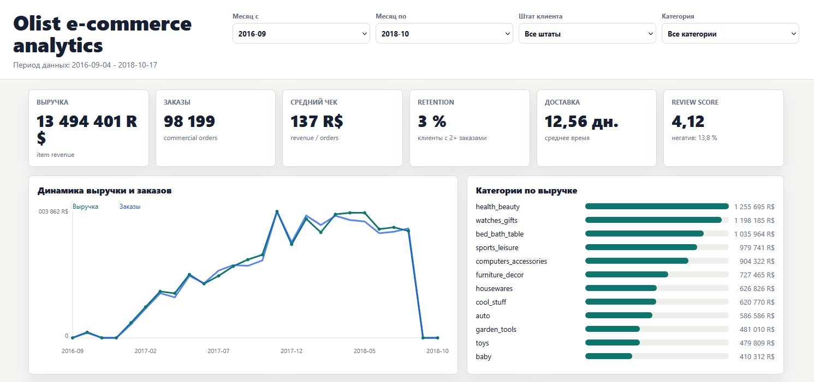
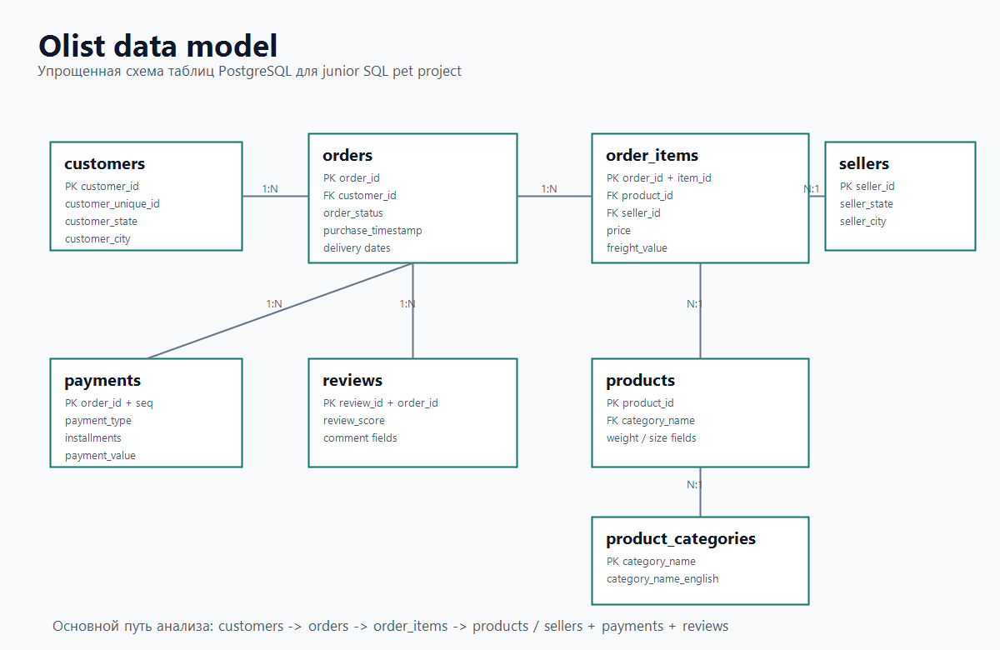

# Olist Marketplace Analytics

Небольшой аналитический пет-проект на датасете Olist Brazilian E-Commerce.  
Цель проекта — продемонстрировать свои скиллы как аналитика и технического специалиста, и создан чтобы стать частью моего резюме и моего портфолио, а так же попасть в виде репозитория на мой гитхаб.



## О проекте

Olist — бразильский маркетплейс, открывший свой рабочий датасет.  
В проекте я разбираю несколько практичных вопросов:

- как меняются выручка, заказы и средний чек по месяцам;
- какие категории, штаты и продавцы дают больше всего выручки;
- сколько клиентов возвращаются за повторной покупкой;
- какие товары продаются лучше и хуже;
- как доставка связана с оценками;
- какие способы оплаты и рассрочки используют покупатели;
- какие проблемы качества данных есть в CSV.

## Структура

```text
project/
|
├── dashboard/
│   ├── index.html
│   ├── build_dashboard_data.py
│   └── dashboard_data.js
│
├── data/
│   └── исходные CSV-файлы Olist
│
├── screenshots/
│   ├── dashboard_overview.png
│   └── data_model.png
│
├── .gitignore
├── docker-compose.yml
├── README.md
├── queries.sql
└── schema.sql
```

## Данные

В проекте используются CSV-файлы Olist:

- customers
- orders
- order items
- payments
- reviews
- products
- sellers
- geolocation
- product category translation

Период данных: `2016-09-04` — `2018-10-17`.

## Как Запустить PostgreSQL

Если PostgreSQL уже установлен локально:

```powershell
createdb olist_analytics
psql -d olist_analytics -f schema.sql
psql -d olist_analytics -f queries.sql
```

Если удобнее через Docker:

```powershell
docker compose up -d
psql -h localhost -U olist_user -d olist_analytics -f schema.sql
psql -h localhost -U olist_user -d olist_analytics -f queries.sql
```

Пароль из `docker-compose.yml`: `olist_password`.

Важно: команды нужно запускать из корня проекта, чтобы `schema.sql` нашел файлы в папке `data/`.

## SQL-Файлы

`schema.sql`:

- создает схему `ecommerce`;
- создает таблицы;
- импортирует CSV через `\copy`;
- добавляет primary keys, foreign keys, checks и индексы;
- создает несколько базовых представлений для простого анализа.

`queries.sql`:

- проверяет качество данных;
- считает KPI;
- отвечает на бизнес-вопросы по продажам, клиентам, товарам, доставке, отзывам и платежам;
- показывает CTE, recursive CTE, window functions, `CASE`, `FILTER`, `RANK`, `DENSE_RANK`, `LAG`, `LEAD`.

## Модель Данных

Основные связи:

- `customers` -> `orders`
- `orders` -> `order_items`
- `orders` -> `order_payments`
- `orders` -> `order_reviews`
- `products` -> `order_items`
- `sellers` -> `order_items`
- `product_categories` -> `products`

Схема модели вынесена в скриншот:



## Основные Метрики

По текущему датасету:

- выручка по коммерческим заказам: `BRL 13 494 400.74`;
- коммерческих заказов с товарными строками: `98 199`;
- средний чек: `BRL 137.42`;
- топ категории: `health_beauty`, `watches_gifts`, `bed_bath_table`, `sports_leisure`, `computers_accessories`;
- основные штаты по выручке: `SP`, `RJ`, `MG`;
- доля повторных клиентов: `3.04%`;
- среднее время доставки: `12.56` дня;
- доля просроченных доставок: `8.11%`;
- средняя оценка: `4.09`;
- доля негативных отзывов: `14.69%`;
- главный способ оплаты по сумме платежей: `credit_card`.

## HTML-Дашборд

Дашборд лежит в папке `dashboard/`. Он работает как локальная HTML-страница и не требует дополнительных файлов для просмотра.

Чтобы обновить данные для дашборда:

```powershell
python dashboard\build_dashboard_data.py
```

Чтобы открыть через локальный сервер:

```powershell
python -m http.server 8765 --directory dashboard
```

После этого открыть:

```text
http://127.0.0.1:8765
```

На дашборде есть:

- KPI-карточки;
- фильтры по периоду, штату и категории;
- динамика выручки и заказов;
- категории и штаты по выручке;
- способы оплаты;
- доставка и оценки;
- когорты клиентов;
- топ продавцов.

## Технологии

- PostgreSQL
- SQL
- Docker Compose
- Python
- HTML/CSS/JavaScript